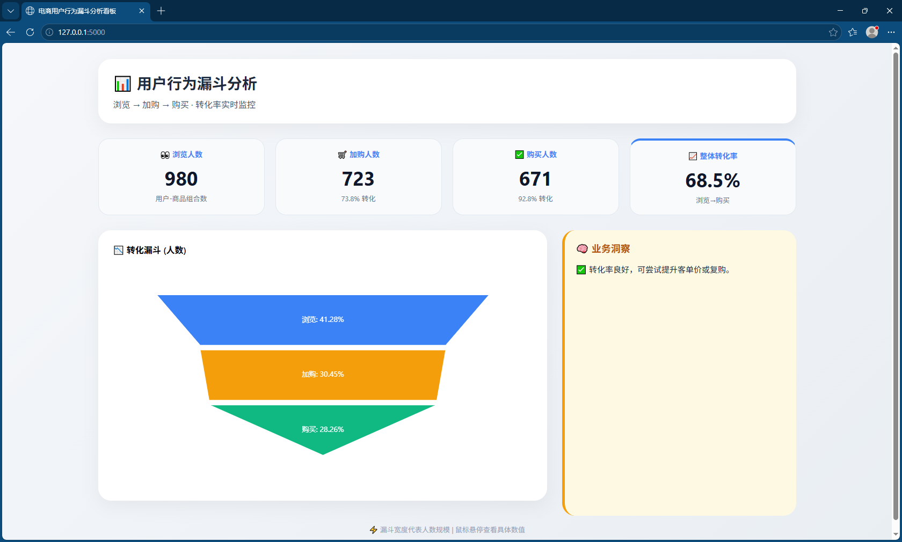

# 电商用户行为漏斗分析看板

> 一个轻量级的用户转化漏斗工具，帮助电商运营快速定位“浏览→加购→购买”环节的流失瓶颈。  
> 技术栈：Python + Pandas + Flask + ECharts

## 功能特点

- 自动生成模拟用户行为数据（或接入真实 CSV）
- 计算各环节转化率（浏览→加购、加购→购买、整体）
- 可视化漏斗图 + 关键指标卡片 + 业务洞察建议
- 支持真实数据替换（淘宝天池数据集、抖店导出等）

## 快速开始

### 1. 克隆项目

```bash
git clone https://github.com/lycifg/ecommerce-funnel-analysis.git
cd ecommerce-funnel-analysis2. 安装依赖
bash
pip install pandas flask
3. 生成模拟数据
bash
python generate_data.py
执行后会在当前目录生成 user_behavior.csv。

4. 启动 Web 服务
bash
python app.py
5. 访问看板
打开浏览器，访问 http://127.0.0.1:5000

项目结构
text
.
├── app.py                 # Flask 后端，提供漏斗数据 API
├── generate_data.py       # 生成模拟用户行为 CSV
├── funnel_analysis.py     # 独立数据分析脚本（可选）
├── templates/
│   └── index.html         # 前端页面（ECharts 漏斗图）
├── .gitignore
└── README.md
数据格式说明
工具需要 user_behavior.csv 文件，包含以下四列：

列名	说明	示例值
user_id	用户标识	1001
action	行为类型	view / add_to_cart / purchase
product_id	商品标识	101
timestamp	发生时间	2025-01-01 10:00:01
你可以用 generate_data.py 生成模拟数据，或将自己的真实数据转换成该格式后替换文件。

真实数据接入示例
淘宝天池数据集：通过脚本将 behavior_type (1/3/4) 映射为 view / add_to_cart / purchase。

抖店导出订单：重命名列并映射状态。

详见 convert_real_data.py 模板（需要自己根据数据源编写）。

效果截图


未来计划
支持按商品类别/日期筛选

部署到云平台（Render / PythonAnywhere）

增加用户留存分析

许可证
MIT License

作者
你的名字 – lycifg
项目链接：https://github.com/lycifg/ecommerce-funnel-analysis

text

---
